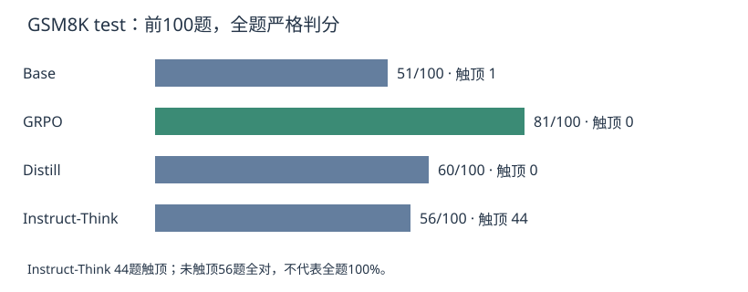

# 纯 GRPO 数学题实验：从 51/100 到 81/100，评估口径也踩了坑

这次我跟着课程做了一个小型“R1-Zero”实验：从已经预训练的 **Qwen3-1.7B-Base** 出发，不先做本实验的 SFT，只用 GSM8K 最终数值的正确性奖励训练。重点是亲手跑通训练、看组内奖励和测试结果，不是完整复现 DeepSeek-R1-Zero。

## 最终结果

训练完成500步，耗时 **2039.68秒，约34分钟**，不包含下载、初始化和评估。最终在 GSM8K test 的前100题上重新评估四个模型：

| 模型 | 全题答对 / 100 | 全题准确率 | 触顶排除 | 未触顶答对 / 可计分 | 未触顶准确率 |
|---|---:|---:|---:|---:|---:|
| Base | 51 / 100 | 51% | 1 | 51 / 99 | 51.52% |
| GRPO | 81 / 100 | 81% | 0 | 81 / 100 | 81% |
| Distill | 60 / 100 | 60% | 0 | 60 / 100 | 60% |
| Instruct-Think | 56 / 100 | 56% | 44 | 56 / 56 | 100% |

**Base→GRPO 净增30个百分点。** 同题逐项复算：35题从错变对，5题从对变错，其余60题正确性不变。分数不仅反映解题，也受到答案表达是否能被严格解析的影响：Base 明确可解析66题，GRPO 98题，因此不能把全部增益解释成新增数学知识。

Instruct-Think 的结果尤其容易误读：44题碰到2048-token上限，剩余56题全部答对。排除触顶题后的100%是条件准确率，不是原100题准确率；各模型剩下的题集不同，不能用这列排名。全题分数把没有明确正确答案的题记错，反映这次给定预算下的表现。

## 训练到底做了什么

流程很短：**GSM8K train → 构造纯文本解题提示 → 每题采8个回答 → 最终数值0/1奖励 → GRPO更新 → 独立test评估**。

| 设置 | 实际训练配置 |
|---|---|
| 起点 | Qwen/Qwen3-1.7B-Base |
| 更新方式 | BF16 全参数；未用LoRA/QLoRA |
| 数据 | openai/gsm8k，main，train；提示超过512 tokens的题过滤 |
| 生成 | G=8，temperature=1.0，top_p=0.95，最大1024 tokens |
| 优化 | 500 steps，学习率5e-6，beta=0.001，seed=42 |
| Batch | 单卡batch=1，梯度累积8，有效生成batch=8 |
| 损失 | TRL GRPOTrainer，loss_type=bnpo，组内奖励缩放开启 |
| 生成加速 | vLLM colocate，显存比例0.3 |
| 硬件 | 训练使用A800 80GB；最终评估卡型未独立核实 |
| 环境 | Python 3.12，PyTorch 2.11.0+cu129，Transformers 4.57.6，TRL 1.14.1，vLLM 0.20.0 |

配置中的 `num_train_epochs=1` 不代表实际训练了一整轮：`max_steps=500` 决定停止，保存指标中的 epoch 约 **0.0669**。这次每步只对应一个8回答组，所以不要把4000条回答当成4000个独立问题。

同组全对或全错时，正确性优势为零；beta非零时仍可能存在KL梯度。因此本项目并没有实现动态补采样，也不能称为DAPO。日志中500步有304步的 `frac_reward_zero_std=1`，这是一个训练效率线索，不等于304道固定错题。

训练奖励前100步平均0.7863，末100步0.8925；对应零方差比例从0.45升到0.67。更多题变成组内全对也可能提高这个比例，不能单凭它判定训练失败。

## 从20题到100题：先修评估，再解释分数

最初只测了20题，生成上限1024、使用宽松解析：Base 13/20、GRPO 15/20、Distill 14/20、Instruct-Think 8/20。随后扩到100题，预算改2048，解析规则也更严格。**这两轮同时改变题数、预算和解析器，不能用分数差推断训练继续进步。它们评估的是同一次训练权重。**

最终协议如下：

- 四模型用同一批test前100题，BF16，不量化，贪心生成，最大2048 tokens。
- Base和GRPO用同一纯文本提示；Distill和Instruct用各自chat模板，Instruct开启thinking。
- 若出现 `</think>`，只在闭合标签后的最终回答里找答案。取最后一个明确 `boxed`，否则找 `####`、答案短语或纯数字。
- 末尾数字回退仅保存用于审计，不用于正式判分。找不到明确答案记为不可解析，不从分母悄悄删掉。
- 达到上限的记录完整保存，另报未触顶准确率、排除数和全题准确率。单独记录EOS，区分触顶与真正截断。
- 前三个模型逐题推理；最后一个改batch=4，逐批保存并支持续跑。批推理可能产生数值差异，这是比较的一个限制。

Qwen3模型卡的thinking模式建议采用采样，并提醒贪心解码可能产生重复。本次沿用贪心方便比较，但并非官方推荐的thinking协议；不能据此断言GRPO普遍强于原版Qwen3思考模型。参见[官方模型卡](https://huggingface.co/Qwen/Qwen3-1.7B)。

## 运行中踩过的坑

| 问题 | 实际处理与边界 |
|---|---|
| GPU计费时下载很慢 | 先无卡安装依赖，数据和缓存放持久存储盘；不把下载耗时算训练速度 |
| flash-attn没装 | 自动回退SDPA，日志打印了回退；配置中请求flash不代表实际用了flash |
| 无卡检查通过、有卡导入失败 | vLLM二进制要求libcudart.so.13，环境只有CUDA12.9 runtime；额外安装CUDA13 runtime并预加载后，有卡导入验证通过 |
| 浏览器卡顿 | 训练输出包含大量生成样本；公开Notebook清空输出，训练日志和评估单独存文件 |
| Instruct评估很慢 | 思考输出长，逐题生成慢；最后一个改batch=4，未重评前三个 |
| 断网与中断担心丢结果 | 每个模型保存JSON；最后一个每批保存partial记录，完成后合并summary |

保存采用 `save_only_model=True`，没有优化器和调度器状态。最终权重可以重新推理评估，但不是可精确续训的完整checkpoint。

## 现在能说什么

这次纯GRPO在固定100题、给定提示和生成预算的协议下，确实提高了可解析正确答案数。结果值得继续验证，但它是**单次训练、测试集前100题**，不是完整GSM8K分数，也不支持与官方benchmark排名比较。

下一步优先做：完整test集评估；抽查不可解析与错题；对thinking参考模型另设采样协议和更充足预算；重复训练种子。先把评估证据补扎实，再考虑SFT→GRPO路线。

## 代码与数据

项目代码、逐题输出、实际训练配置和日志见 [GitHub项目仓库](https://github.com/cppywh/mini-deepseek-r1-zero)。模型权重只备份本地，不推到GitHub。文章中的100题指标由保存的逐题JSON复算；20题结果来自Notebook输出转录，未独立复算。

课程来源：[第4课实验：迷你DeepSeek-R1-Zero](https://posttrain.gaozhijun.me/docs/lecture-4/lab/)。数据来源：[openai/gsm8k](https://huggingface.co/datasets/openai/gsm8k)。

### 文件入口与复核

- [Notebook](mini_deepseek_r1_zero.ipynb)：当前实现，训练阶段与最终评估预算不同；已清空执行输出。
- [实际训练配置](results/experiment_config.json)：训练时保存，评估参数仍是旧20题/1024；最终100题协议以[protocol.json](results/protocol.json)为准。
- [四模型结果表](results/summary.csv)：排除触顶的分数与全题分数并列。
- results/{模型名}.json：逐题生成、标准数值、提取结果和触顶标记。数据来自公开GSM8K题目与本实验模型生成，不包含原始训练全集。
- [复算脚本](recompute_results.py)：在项目目录运行 `python recompute_results.py`，不需要GPU或模型权重。
- [训练日志](results/log_history.json)：500步真实指标。
- requirements*.txt：固定依赖；服务器曾额外安装 nvidia-cuda-runtime==13.0.96，project_paths.py在Linux预加载该runtime。应按GPU驱动核对兼容性，不宣称任意环境均可直接运行。

重启后只评估：Notebook第1、2、3节；第4节解析和奖励定义；第5节函数定义（跳过加载训练模型）；第5.1节生成函数；第8节函数定义（跳过样例调用）；第9节评估。保持原实验run_name和Base模型；4090硬件评估不要改成0.6B训练档位。权重未包含在仓库中，需要自行训练或使用本地备份。

题目数据的来源与许可证见[openai/gsm8k数据卡](https://huggingface.co/datasets/openai/gsm8k)。本仓库未声称对第三方模型、数据或课程内容拥有所有权。
